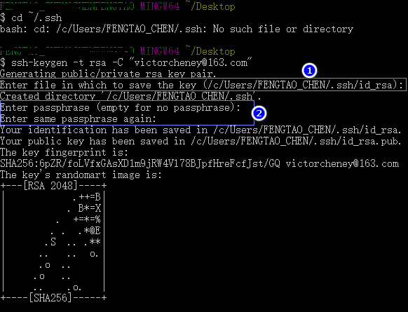
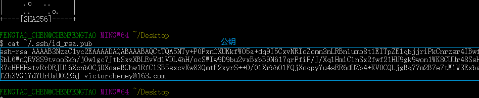
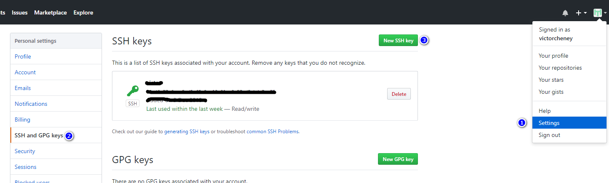
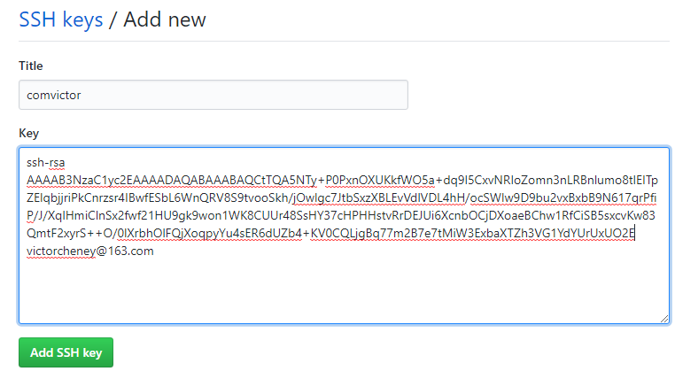
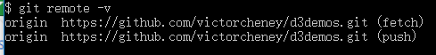
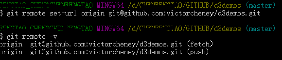

# github配置SSH

在获取github链接时，可以发现有两种方式的链接，一种是使用https 克隆，另一种是使用SSH密钥的方式。
通常情况下使用https方式就可以进行克隆代码，如果要使用SSH的话就需要进行相关的配置。在本地生成密钥对，然后在github上设置公钥，在提交和拉取代码时就可以不用输入账号密码；
当然如果配置SSH设置了密码，在拉取或提交时还是需要输入密码的。使用https协议通常需要输入账号和密码。

## 在本地生成SSH密钥对

首先进入到公钥默认存储主目录：

在桌面或者任意文件夹中，右键打开gitbash，输入命令 `cd ~/.ssh`

如果显示没有找到目录，说明在电脑行还没有进行任何ssh相关操作，没有生成该目录。

    $ cd ~/.ssh
    bash: cd: /c/Users/FENGTAO_CHEN/.ssh: No such file or directory

如果进入到目录中，查看是否已经存在生成的公钥（id_rsa和id_rsa.pub），如果存在，在后面生成公钥是可能需要输入另外的名字。

下一步输入如下命令，然后回车：

    $ ssh-keygen -t rsa -C "your_email@youremail.com"

your_email@youremail.com是github登录账号。

结果如下图：

图片说明：标注一提示输入公钥文件名称，标注二提示输入密码。

到此为止，本地的密钥对生成完毕。

查看生成的公钥，输入命令：`cat ~/.ssh/id_rsa.pub`

公钥在配置到github时，要用到。

## 添加公钥github

登录github网站，点击头像->Setting-> 左边栏SSH and GPG keys -> New SSH key

进入到添加界面，输入title和key，key值即为输入 `cat ~/.ssh/id_rsa.pub`命令查看的值，蓝色线内的值，然后保存

点击添加，让你输入一次github的密码，输入正确提交，返回到SSH keys页面，就会显示刚刚添加的SSH key。

输入测试命令： `ssh -T git@github.com`

按照提示进行操作即可，显示 `Hi [yourname]! You've successfully authenticated, but GitHub does not provide shell access.`即表示成功。

现在就可以使用SSH进行新的项目的colne了。

## 修改使用HTTPS协议克隆的项目远程地址

使用命令 `git remote -v` 查看你当前项目的远程路径

在github中进入到当前目录复制，SSH对应的路径： `git@github.com:victorcheney/d3demos.git`

使用 `git remote set-url` 命令来设置远程链接地址

再次查看地址已经变为了SSH。

配置过程记录完毕。
