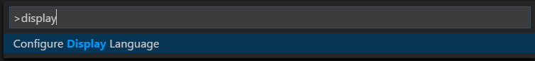

# vscode设置中文

1、下载中文语言包
    在扩展中搜索Chinese Language，然后安装；

2、快捷键`Ctrl+shift+p`打开命令板，输入`Configure Display Language`,回车进入到`local.json`文件

修改local属性：

    {
        // Defines VS Code's display language.
        "locale":"zh-CN"
    }

保存后，重启vscode即可

参考：[https://code.visualstudio.com/docs/getstarted/locales](https://code.visualstudio.com/docs/getstarted/locales)